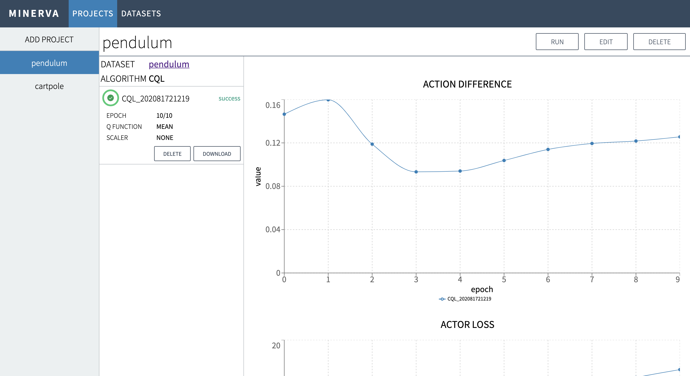

<div align="center"></div>

# MINERVA: An out-of-the-box GUI tool for data-driven deep reinforcement learning


[](https://minerva-ui.readthedocs.io/en/latest/?badge=latest)
[](https://codecov.io/gh/takuseno/minerva)

[](https://gitter.im/d3rlpy/minerva)

MINERVA is an Out-of-the-box GUI Tool for Data-Driven Deep Reinforcement
Learning, designed for everyone including non-programmers to do reinforcement
learning as a tool.

<div align="center"></div>

Documentation: https://minerva-ui.readthedocs.io

## key features
### :zap: All You Need Is Dataset
MINERVA only requires datasets to start data-driven deep reinforcement learning.
Any combinations of vector observations and image observations with discrete
actions and continuous actions are supported.

### :beginner: Stunning GUI
MINERVA provides designed with intuitive GUI to let everyone lerverage extremely
powerful algorithms without barriers. The GUI is developed as a Single Page
Application (SPA) to make it work in the eye-opening speed.

### :rocket: Powerful Algorithm
MINERVA is powered by [d3rlpy](https://github.com/takuseno/d3rlpy), a powerful
data-driven deep reinforcement learning library for Python, to provide
extremely powerful algorithms in an out-of-the-box way. The trained policy can
be exported as [TorchScript](https://pytorch.org/docs/stable/jit.html) and
[ONNX](https://onnx.ai/).

## installation
```
$ pip install minerva-ui
```

## update guide

If you update MINERVA, the database schema should be also updated as follows:
```
$ pip install -U minerva-ui
$ minerva upgrade-db
```

## usage
### run server
At the first time, `~/.minerva` will be automatically created to store
database, uploaded datasets and training metrics.
```
$ minerva run
```
You can change the host and port with `--host` and `--port` arguments
respectively.


### delete data
You can delete entire data (`~/.minerva`) as follows:
```
$ minerva clean
```

## contributions
### build
```
$ npm install
$ npm run build
```

### coding style
This repository is fully formatted with [yapf](https://github.com/google/yapf)
and [standard](https://github.com/standard/standard).
You can format the entire scripts as follows:
```
$ ./scripts/format
```

### lint
This repository is fully analyzed with [Pylint](https://github.com/PyCQA/pylint),
[ESLint](https://github.com/eslint/eslint) and [sass-lint](https://github.com/sasstools/sass-lint).
You can run analysis as follows:
```
$ ./scripts/lint
```

### test
The unit tests are provided as much as possible.
This repository is using `pytest-cov` instead of `pytest`.
You can run the entire tests as follows:
```
$ ./scripts/test
```

## acknowledgement
This work is supported by Information-technology Promotion Agency, Japan
(IPA), Exploratory IT Human Resources Project (MITOU Program) in the fiscal
year 2020.
