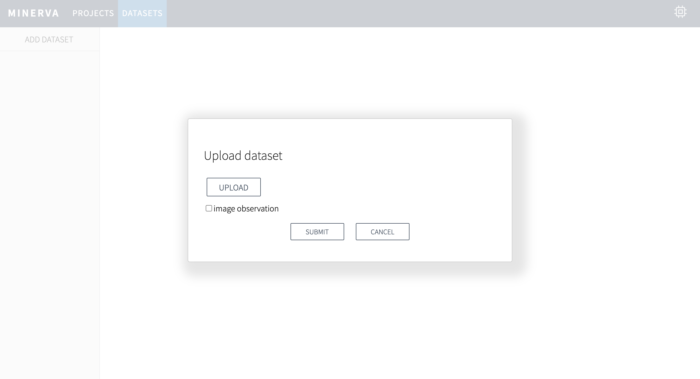

***************
Getting Started
***************

Prepare Datasets
----------------

Dataset with vector observation
~~~~~~~~~~~~~~~~~~~~~~~~~~~~~~~

The dataset must be a CSV file containing the following columns.
The data should be chronologically ordered.

.. list-table:: columns
   :header-rows: 1

   * - column name
     - description
   * - episode
     - an episode ID
   * - observation:X
     - a real value for the Xth dimension in an observation
   * - action:X
     - a real value for the Xth dimension in an action (continuous control) or an action ID (discrete control)
   * - reward
     - a real value for reward

This is an example CartPole data::

  episode,observation:0,observation:1,observation:2,observation:3,action:0,reward
  0,0.03197332076282214,0.023978136772313002,-0.01460231690901137,0.01428123941035453,1,0.0
  0,0.0324528834982684,0.21930642661209865,-0.01431669212080428,-0.28297288746447075,0,1.0
  .
  .
  .

Dataset with image observation
~~~~~~~~~~~~~~~~~~~~~~~~~~~~~~

The dataset must contain a CSV file and image files.
The data must contain the following columns.

.. list-table:: columns
   :header-rows: 1

   * - column name
     - description
   * - episode
     - an episode ID
   * - observation:0
     - a image file name (e.g. observation_0.png)
   * - action:X
     - a real value for the Xth dimension in an action (continuous control) or an action ID (discrete control)
   * - reward
     - a real value for reward

This is an example::

  episode,observation:0,action:0,reward
  0,observation_0.png,1,0.0
  0,observation_1.png,0,0.0
  .
  .
  .

.. note::

  The image files must be located in the directory that contains only image files to upload.

Start Server
------------

At the first launch, ``$HOME/.minerva`` will be created to store datasets, databases and training metrics.
You can configure this by setting ``$MINERVA_DIR``.
For example::

  $ export MINERVA_DIR=$HOME/.custom_dir

Now you can start MINERVA as follows::

  $ minerva run [--host HOST_NAME] [--port PORT]

Then, open http://localhost:9000 and you'll see the MINERVA UI.

.. image:: ./assets/startup.jpg

.. _upload_dataset:

Upload Dataset
--------------

To upload a new dataset, click ``ADD DATASET`` button.

.. image:: ./assets/add_dataset.jpg

Upload dataset with vector observation
~~~~~~~~~~~~~~~~~~~~~~~~~~~~~~~~~~~~~~

1. Click ``UPLOAD`` button to select the dataset CSV file.
2. Check ``discrete control`` if the action-space is discrete.
3. Click ``SUBMIT`` to upload the dataset.

This is an example dashboard screen after uploading a vector dataset.

.. image:: ./assets/dataset_dashboard_vector.jpg

Upload dataset with image observation
~~~~~~~~~~~~~~~~~~~~~~~~~~~~~~~~~~~~~

1. Click ``UPLOAD`` button to select the dataset CSV file.
2. Check ``discrete control`` if the action-space is discrete.
3. Check ``image observation``.
4. Click ``UPLOAD IMAGE DIRECTORY`` button to select the directory containing image files.
5. Click ``SUBMIT`` to upload the dataset.

This is an example dashboard screen after uploading an image dataset.

.. image:: ./assets/dataset_dashboard_image.jpg

.. note::

  The all files in the selected directory will be uploaded.

Create Project
--------------

To create a new project, click ``ADD PROJECT`` in the project page.

.. image:: ./assets/add_project.jpg

Then,

1. Choose a dataset from the uploaded ones.
2. Fill the project name.
3. Click ``SUBMIT`` button to create.

.. _start_training:

Start Training
--------------

Once you created a project, you will see an empty project like below.

.. image:: ./assets/project_page.jpg

Click ``RUN`` button to start training.

.. image:: ./assets/run_button.jpg

Train with vector observation
~~~~~~~~~~~~~~~~~~~~~~~~~~~~~

1. Configure training settings.
2. Choose device to use CPU or GPU.
3. (optional) Configure advanced settings to click ``SHOW ADVANCED CONFIGURATIONS``.
4. Click ``SUBMIT`` to start training.

.. image:: ./assets/experiment_dialog.jpg

Train with image observation
~~~~~~~~~~~~~~~~~~~~~~~~~~~~

To train with image observation, you will see different configurations from
vector observation projects.
The most important option is ``N_FRAMES`` which controls frame stacking to
handle temporal data without recurrent networks.

.. image:: ./assets/image_experiment_dialog.jpg

.. note::

  Basically, the ``SCALER`` option should be set to ``PIXEL`` when training with image observation.

Once starting training, you will see information about your training.
If you need to kill the training process in the middle of training,
click ``CANCEL`` button.

.. image:: ./assets/training.jpg

.. _export_policy_function:

Export Policy Function
----------------------

To export the trained policy, click ``DOWNLOAD`` button.

.. image:: ./assets/download_button.jpg

Then,

1. Choose an epoch to export.
2. Choose a format (e.g. TorchScript and ONNX).
3. Click ``DOWNLOAD``.

.. image:: ./assets/export_dialog.jpg

See how you use the exported policy at :ref:`tutorial_deploy`.
